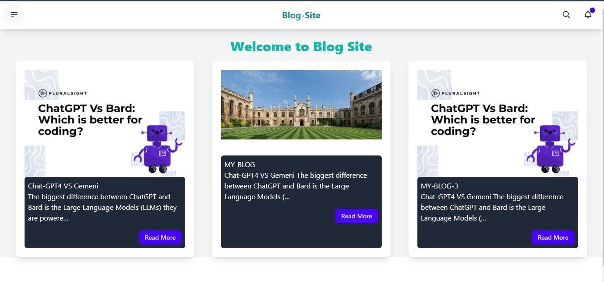
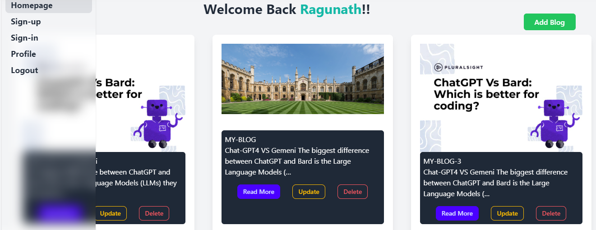

# Minimalistic Blogging Platform

This is a minimalistic blogging platform built using Django. The platform allows users to create accounts, write blog posts, and view posts by other users.

## Features

- User Authentication:
  - Users can register for an account.
  - Users can log in and log out.
- Blog Posts:
  - Authenticated users can create, edit, and delete their own blog posts.
  - Posts have a title, content, publication date, and author.
- Viewing Blog Posts:
  - Users can view all blog posts on the platform, sorted by publication date.

## Installation

1. Clone the repository:

   ```bash
   git clone https://github.com/Ragu507/Django-based-Blog-app.git

2. Install dependencies:
   
   ```bash
    pip install -r requirements.txt
   
3. Apply migrations:
   
    ```bash
    python manage.py migrate
    
4. Run the development server:

    ```bash
    python manage.py runserver

## Usage

1. Register for an account or log in if you already have one.
2. Create, edit, or delete your blog posts.
3. View all blog posts on the platform.


## Screenshots

### Home Page


### Profile Page



